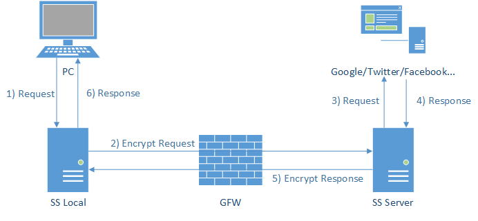

### 0. 引言
类似 shadowsocks，v2ray，trojan 之类的代理软件原理，用一张很老的图就能概括：


是不是很简单呀？那么今天我们就来简单实现一下。不过鉴于这种基石软件用的人数之多，网上想必也有很多类似的文章，我再写这种陈词滥调一是无聊，二是无用。所以我打算加一点新鲜东西，讲述一个代理软件是如何一步步将简单的转发流量的功能拓展到：

- 多个监听和转发端口
- 支持多种协议
- 路由功能
- ...

最主要的还是记录下我对这种软件的各个部件如何设计和组织的理解。

因此，写下本文的主要目的是：

- 记录代理软件的原理和实现
- 描绘整个软件的设计框架
- ~~回顾下我是怎么写出这破代码的~~

整个项目使用 C++ 编写，其中我使用了 [asio](https://think-async.com/Asio/) 库，真的很好用，谁用谁知道！

Let's go!

### 1. 开始

##### 从哪开始？

就像老牛吃南瓜——无从下口，我们应该从哪里开始？代理软件的核心是转发流量，用 v2ray 中的名词，不管是 local 端还是 server 端，都需要 inbound（入站）和 outbound（出站）。由于 local 端和 server 端运行的是同一套软件，我们只需暂时将注意力集中在 local 上的设计即可。

现在我们再次将问题简化，设计一个仅将流量原封不动地转发到互联网的东西，它看起来就像：

```
         socks  +---------+          +----------+
browser <======>| inbound |<========>| outbound |<======> internet
                +---------+          +----------+
```

##### 监听本地

既然要转发流量，首先就要监听到流量，我们使用 `127.0.0.1:8888 ` 作为监听地址监听本地流量。我们需要通过这个 socket 不断 accept 浏览器的请求，随后再通过读写通过 accept 得到的 socket 处理后续连接：

``` cpp
static io_context ctx;
static ip::tcp::acceptor listen_sock(
    ctx,
    ip::tcp::endpoint(ip::address::from_string("127.0.0.1"), 8888)
);

using tcp_sock = ip::tcp::socket;
using tcp_sock_p = shared_ptr<tcp_sock>;
void to_listen() {
  tcp_sock_p sp(new tcp_sock(ctx));
  listen_sock.async_accept(*sp, [sp](const error_code err) {
    if (!err) {
      // TODO: 在这里处理通过 accept 得到的 socket
    }
    to_listen();
  });
}

int main() {
  to_listen();
  ctx.run();
  return 0;
}
```

上面就是整个程序的入口，`to_listen()` 中通过调用 `listen_sock.async_accept()`，我们会把 remote sock 的信息写入到第一个参数，而作为第二个参数的 lambda 函数是 `async_accept()` 的 callback，这个函数会在 accept 工作完成，即，第一个参数被写入 remote sock 的信息后被调用；于是这个 callback 函数的逻辑就很清晰了：处理 remote sock，并调用 `to_listen()` 继续监听下一个到来的连接。

需要注意两点：

- 这里处理 remote sock 的代码必须也是异步的，否则会阻塞监听下一个 sock
- 传入 `async_accept()` 的 sock 必须分配在堆上。原因是 `async_accept()` 作为异步函数会立即返回，`to_listen()` 可能在 `async_accept()` 完成工作前就早早返回，如果 sock 分配在栈上可能会被过早回收。

我们已经得到了需要进行读写操作的 sock，而我们应该如何继续处理这个烫手山芋呢？

つづく
